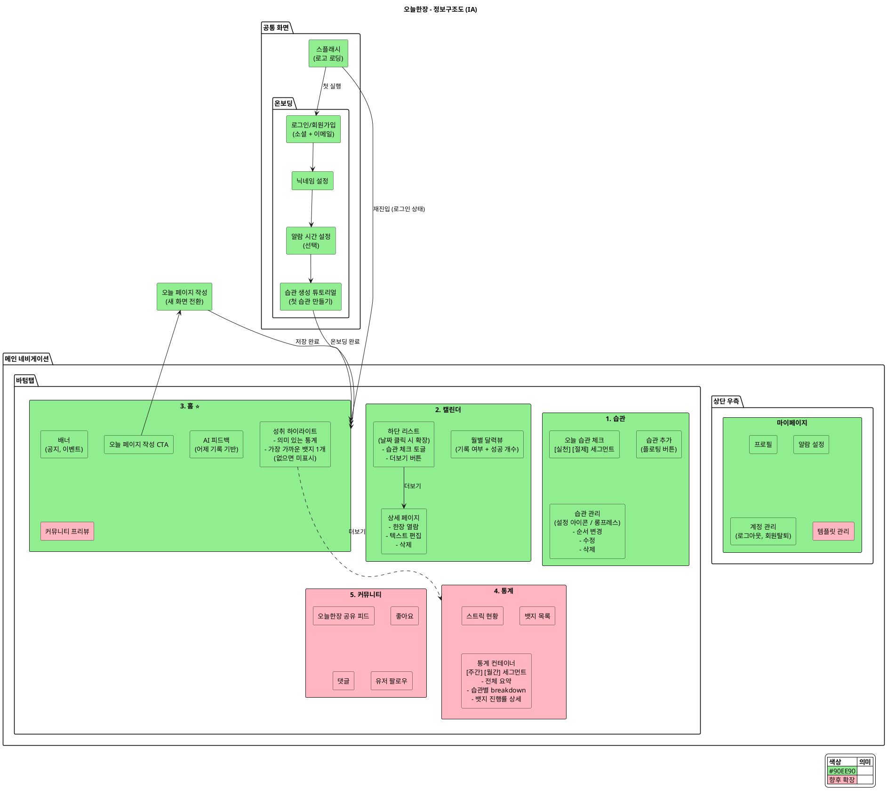
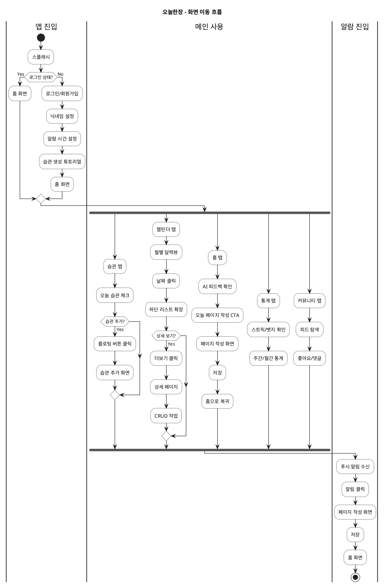

# 오늘한장 - 정보구조도 (Information Architecture)

> **하루 한 장, 나를 완성하는 기록**
> 
> 매일 한 페이지씩 하루를 기록하여 나만의 인생 노트를 완성하는 습관 형성 플랫폼

---

## 1. 용어 설명

| 용어 | 의미 |
|------|------|
| **스플래시(Splash)** | 앱 처음 실행 시 로고가 표시되는 로딩 화면 (1~2초) |
| **온보딩(Onboarding)** | 첫 사용자가 앱에 "탑승"하는 과정. 회원가입, 초기 설정, 튜토리얼 등 포함 |
| **CTA (Call To Action)** | 행동 유도 버튼. 예: "오늘 한장 쓰러가기" |
| **랜딩(Landing)** | 특정 액션 후 도착하는 화면. 예: 알람 클릭 시 어디로 이동하는가 |
| **배너(Banner)** | 공지, 이벤트, 프로모션 등을 표시하는 캐러셀/카드 영역 |
| **바텀시트(Bottom Sheet)** | 화면 하단에서 올라오는 시트 형태의 UI |
| **세그먼트(Segment)** | 같은 컨테이너 내에서 탭 전환하는 UI. 예: [주간] [월간] |
| **플로팅 버튼(FAB)** | 화면 위에 떠 있는 액션 버튼. 주로 + 추가 기능 |

### 습관 분류 체계

| 유형 | 설명 | 체크 방식 |
|------|------|----------|
| **실천 습관** | 매일 의식적으로 챙겨야 하는 습관 | 성공한 날 체크 (미체크 = 실패) |
| **절제 습관** | 평소엔 지켜지지만 깨졌을 때만 기록 | 실패한 날 체크 (미체크 = 성공) |

---

## 2. 전체 IA 구조도

### 2.1 네비게이션 구조

```
┌─────────────────────────────────────────────────────────────┐
│                        [상단 우측]                           │
│                        마이페이지 ⚙️                         │
├─────────────────────────────────────────────────────────────┤
│                                                             │
│                      [ 메인 콘텐츠 ]                         │
│                                                             │
├─────────────────────────────────────────────────────────────┤
│  [습관]    [캘린더]    [홈]     [통계]    [커뮤니티]          │
│                        ↑                                    │
│                      중앙                                   │
└─────────────────────────────────────────────────────────────┘
```

### 2.2 PlantUML - 전체 IA 구조



### 2.3 PlantUML - 화면 이동 흐름



---

## 3. 탭별 상세 구성

### 3.1 습관 탭

| 구성 요소 | 설명 | MVP |
|----------|------|-----|
| **오늘 습관 체크** | 기본 화면, 오늘 날짜 기준 습관 체크 | ✅ |
| **상단 세그먼트** | [실천습관] [절제습관] 전환 | ✅ |
| **플로팅 버튼** | + 습관 추가 | ✅ |
| **설정 아이콘** | 우측 상단, 습관 관리 모드 (순서 변경) | ✅ |
| **롱프레스** | 개별 습관 수정/삭제 | ✅ |

### 3.2 캘린더 탭

| 구성 요소 | 설명 | MVP |
|----------|------|-----|
| **월별 달력뷰** | 날짜별 기록 여부 + 습관 성공 개수 표시 | ✅ |
| **하단 리스트** | 날짜 클릭 시 확장 (달력 유지) | ✅ |
| ↳ 습관 체크 토글 | 인라인에서 빠른 조작 | ✅ |
| ↳ 더보기 버튼 | 상세 페이지로 이동 | ✅ |
| **상세 페이지** | 한장 열람, 텍스트 편집, 삭제 | ✅ |

### 3.3 홈 탭 (중앙)

| 구성 요소 | 설명 | MVP |
|----------|------|-----|
| **배너** | 공지, 이벤트, 프로모션 | ✅ |
| **AI 피드백** | 어제 기록 기반 공감/응원 메시지 | ✅ |
| **오늘 페이지 작성 CTA** | 메인 행동 유도 버튼 → 새 화면 전환 | ✅ |
| **성취 하이라이트** | 의미 있는 통계 + 가장 가까운 뱃지 1개 (없으면 미표시) | ✅ |
| **커뮤니티 프리뷰** | 인기 게시물 등 | ❌ 향후 |

### 3.4 통계 탭

| 구성 요소 | 설명 | MVP |
|----------|------|-----|
| **스트릭 현황** | 상단 고정, 연속 기록 일수 | ❌ 향후 |
| **뱃지 목록** | 상단 고정, 획득한 뱃지 | ❌ 향후 |
| **통계 컨테이너** | [주간] [월간] 세그먼트 탭 | ❌ 향후 |
| ↳ 전체 요약 | 기간별 성공률 등 | ❌ 향후 |
| ↳ 습관별 breakdown | 각 습관 성공률 | ❌ 향후 |
| ↳ 뱃지 진행률 상세 | 습관별 진행 중인 뱃지 | ❌ 향후 |

### 3.5 커뮤니티 탭

| 구성 요소 | 설명 | MVP |
|----------|------|-----|
| **오늘한장 공유 피드** | SNS형 피드 | ❌ 향후 |
| **좋아요** | 게시물 좋아요 | ❌ 향후 |
| **댓글** | 게시물 댓글 | ❌ 향후 |
| **유저 팔로우** | 유저 간 팔로우 | ❌ 향후 |
| ~~템플릿 공유~~ | ~~제외~~ | ❌ 제외 |

### 3.6 마이페이지 (상단 우측)

| 구성 요소 | 설명 | MVP |
|----------|------|-----|
| **프로필** | 닉네임, 프로필 이미지 | ✅ |
| **알람 설정** | 기록 알림 시간 | ✅ |
| **계정 관리** | 로그아웃, 회원탈퇴 | ✅ |
| **템플릿 관리** | 페이지 레이아웃/블럭 구성 | ❌ 향후 |

---

## 4. 공통 화면

### 4.1 스플래시

- 앱 실행 시 로고 표시 (1~2초)
- 로그인 상태 확인 후 분기

### 4.2 온보딩 흐름

```
스플래시
    ↓
로그인/회원가입 (소셜 + 이메일)
    ↓
닉네임 설정
    ↓
알람 시간 설정 (선택)
    ↓
습관 생성 튜토리얼
    → "첫 습관을 만들어볼까요?"
    → 습관 이름 입력 + 유형 선택 (실천/절제)
    ↓
홈 진입
```

### 4.3 오늘 페이지 작성

- 홈 CTA 클릭 → **새 화면 전환** (전체 화면)
- 알람 탭 → **페이지 작성 화면**으로 직접 랜딩
- 작성 완료 후 → 홈으로 복귀

---

## 5. 뱃지 시스템

### 5.1 핵심 철학

단순 "7일 달성", "30일 달성" 같은 숫자가 아니라, **객관적 지표를 창의적으로 환산**해서 재미와 성취감을 동시에 준다.

### 5.2 예시 패턴

| 습관 | 마일스톤 흐름 |
|------|-------------|
| **달리기 (3km/일)** | 하프마라톤(21km) → 풀마라톤(42km) → 서울-부산(400km) |
| **금연** | 치킨 1마리 값 → 폐 청소 시작 시점 → 오마카세 → 에어팟 → 유럽 왕복 항공권 |
| **물 (2L/일)** | 정수기 물통 → 대야 → 욕조 → 소방차 물탱크 → 작은 수영장 |

> 금액, 건강, 유머 등 다양한 관점을 섞어서 지루하지 않게

### 5.3 뱃지 구조

| 유형 | 설명 |
|------|------|
| **프리셋 뱃지** | 자주 쓰는 습관에 미리 준비된 창의적 마일스톤 |
| **커스텀 뱃지** | 사용자가 직접 목표 세분화해서 저장 |
| **AI 생성 옵션** | 습관 입력 → AI가 뱃지 목록 제안 → 일부 수정 가능 → 저장 |

### 5.4 진행률 표시

- 습관당 진행 중인 뱃지: **0~1개**
- **홈**: 가장 가까운 뱃지 1개만 하이라이트
- **통계 탭**: 전체 뱃지 진행률 상세 (습관별)

---

## 6. MVP 범위

### 6.1 MVP 포함

| 항목 | 내용 |
|------|------|
| **바텀탭** | 홈, 캘린더, 습관 (3탭 구현) |
| **통계/커뮤니티** | "준비 중" 또는 숨김 처리 |
| **마이페이지** | 프로필, 알람, 계정관리 |
| **페이지 형식** | 1분할 자유 텍스트 |
| **AI 피드백** | OpenAI 연동 |

### 6.2 향후 확장

| 항목 | 내용 |
|------|------|
| **통계 탭** | 스트릭, 뱃지, 주간/월간 통계 |
| **커뮤니티 탭** | 피드, 좋아요, 댓글, 팔로우 |
| **템플릿 관리** | 2분할/4분할 레이아웃, 다양한 블럭 |
| **책 넘기기 뷰** | 몰입감 있는 열람 UI |

---

## 7. 논의사항

### 7.1 마이페이지 위치

**논의 내용:**
- 바텀탭에 넣으면 탭이 6개로 많아짐
- 마이페이지는 "설정" 성격이 강함

**결정:**
- **상단 우측** 아이콘으로 배치
- 토스, 카카오뱅크, 배달의민족 등 참고

**근거:**
- 설정/계정 성격이 강하면 → 상단
- 개인 콘텐츠(내 피드 등)가 있으면 → 바텀탭

### 7.2 캘린더 vs 통계 분리

**논의 내용:**
- 캘린더에도 기록 여부, 성공 개수 표시됨
- 통계와 겹치지 않나?

**결정:**
- **분리 유지**
- 캘린더 = 날짜 중심 열람/편집
- 통계 = 기간 중심 분석/성취

### 7.3 습관 탭 구조

**논의 내용:**
- 습관 체크와 습관 관리를 어떻게 구분?

**결정:**
- 기본 화면: 오늘 습관 체크
- 설정 아이콘: 관리 모드 (순서 변경)
- 롱프레스: 개별 수정/삭제

### 7.4 바텀탭 순서

**논의 내용:**
- 홈이 중앙에 있는 게 좋겠다

**결정:**
- `습관 → 캘린더 → 홈(중앙) → 통계 → 커뮤니티`
- 좌측: 자주 쓰는 기능 (매일)
- 우측: 분석/소셜 (가끔)

---

## 8. 부록: 바텀탭 아이콘 제안

| 탭 | 아이콘 제안 |
|----|-----------|
| 습관 | ✓ 체크마크 / 📋 체크리스트 |
| 캘린더 | 📅 달력 |
| 홈 | 🏠 홈 / 📖 책 |
| 통계 | 📊 차트 |
| 커뮤니티 | 👥 사람들 / 💬 말풍선 |

---

**작성일:** 2026-01-18  
**작성자:** 정우찬  
**버전:** v1.0
