# 오늘한장 시퀀스 다이어그램

## 개요

주요 기능별 시퀀스 다이어그램을 PlantUML 형식으로 정리한 문서.

---

## 1. Auth

### 1.1 회원가입

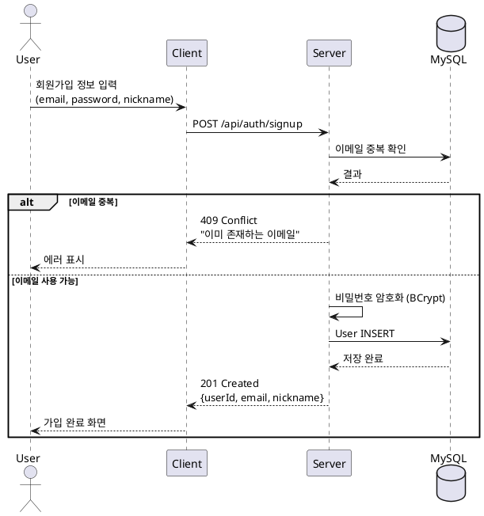

### 1.2 로그인

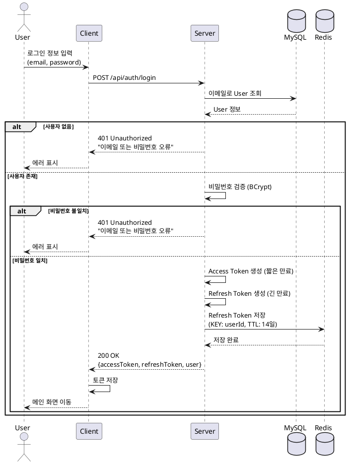

### 1.3 토큰 재발급 (RTR)

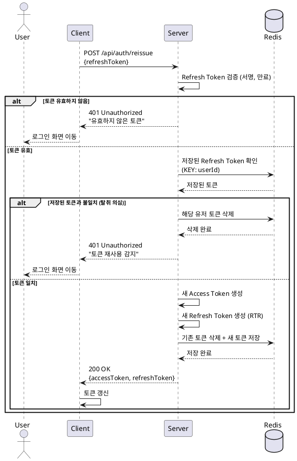

### 1.4 로그아웃

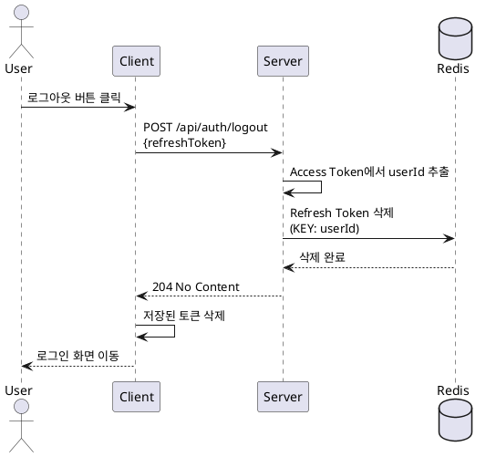

---

## 2. Habit

### 2.1 시스템 습관 목록 조회

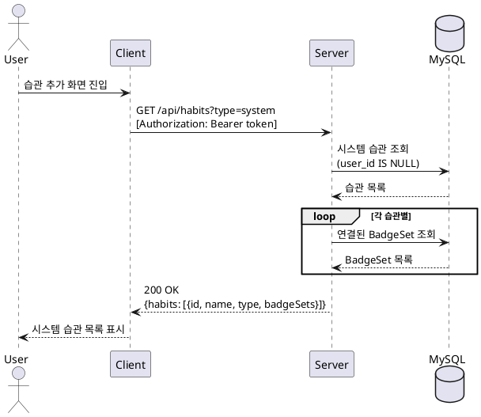

### 2.2 커스텀 습관 생성

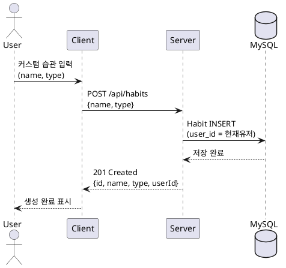

### 2.3 커스텀 습관 수정

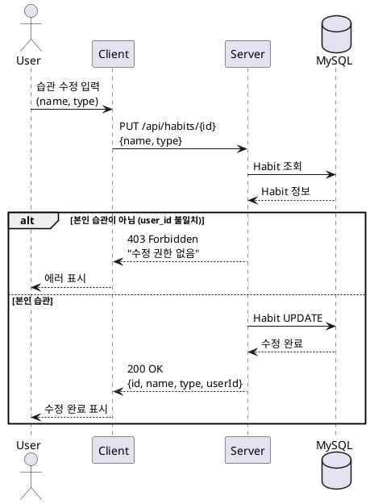

### 2.4 커스텀 습관 삭제

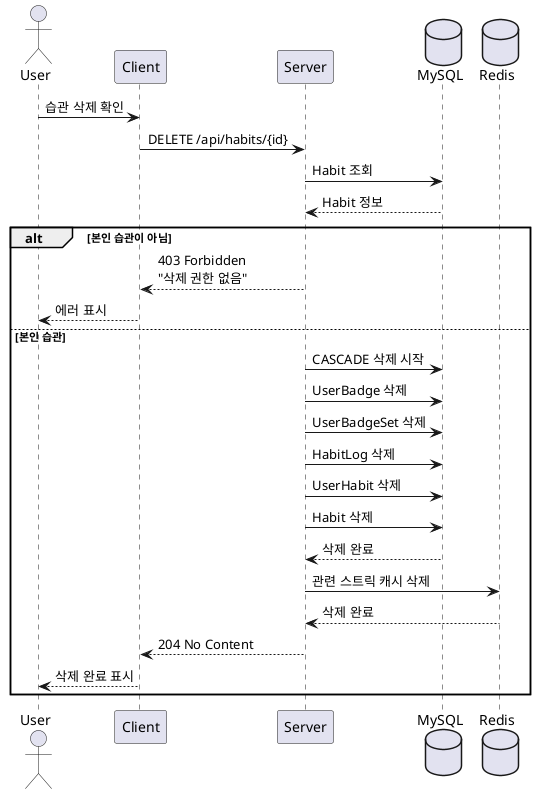

---

## 3. UserHabit

### 3.1 시스템 습관 등록

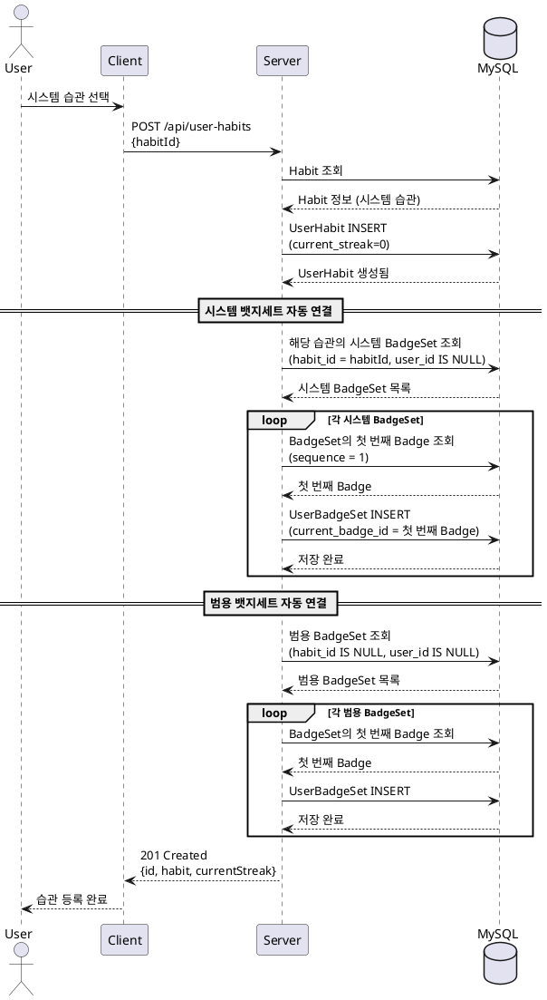

### 3.2 커스텀 습관 등록

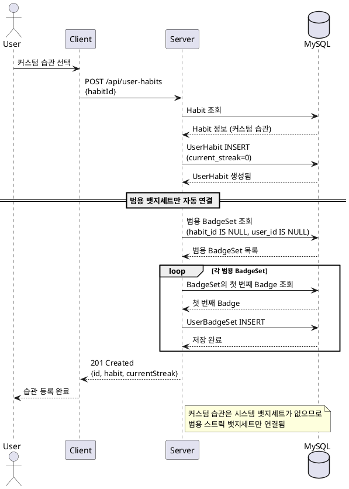

### 3.3 내 습관 목록 조회

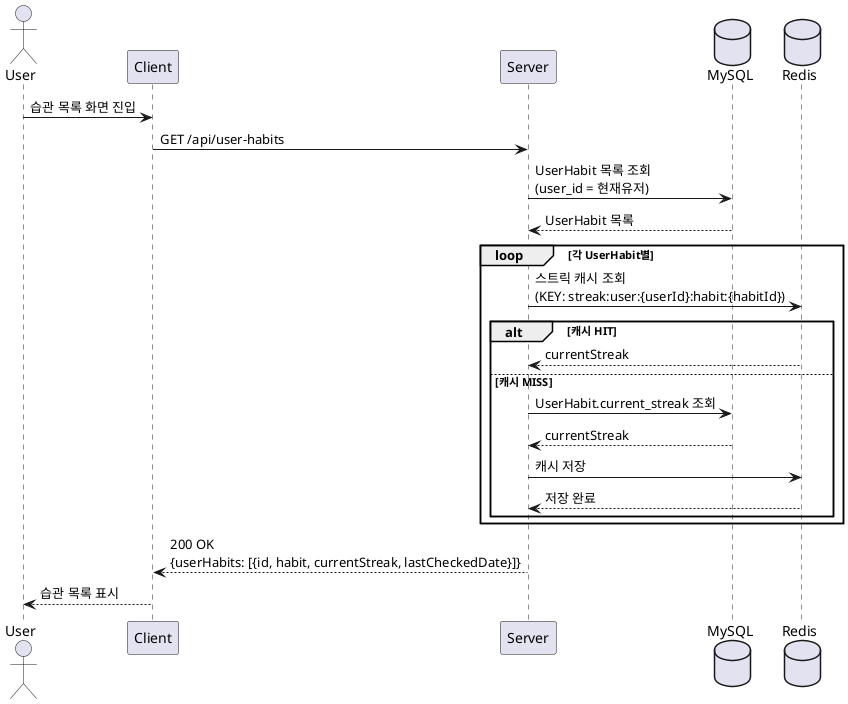

### 3.4 내 습관 상세 조회

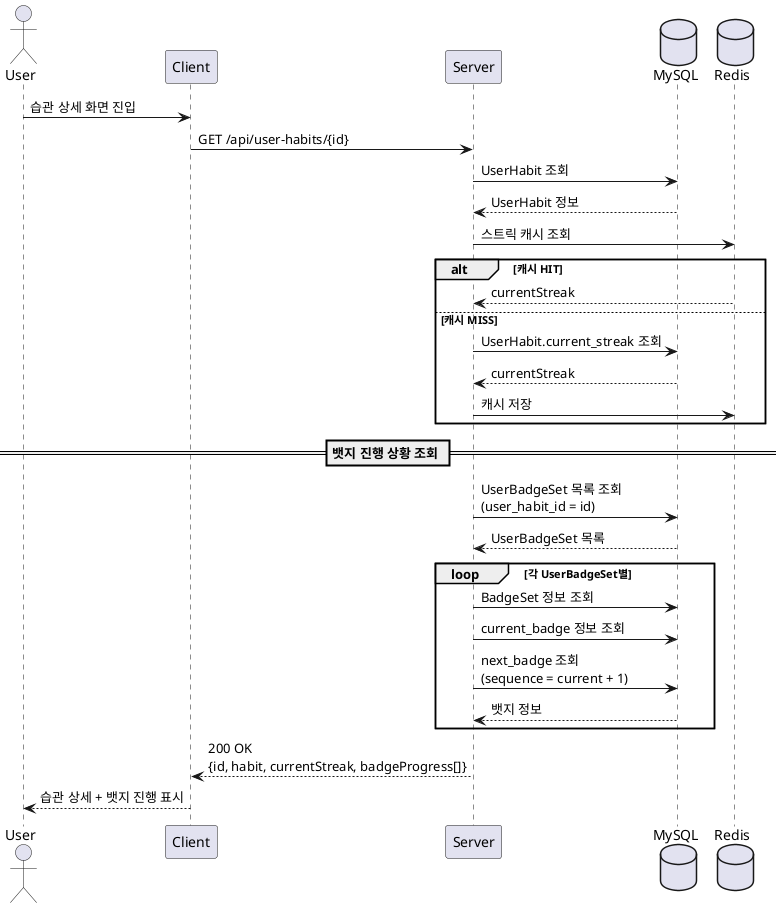

### 3.5 내 습관 삭제

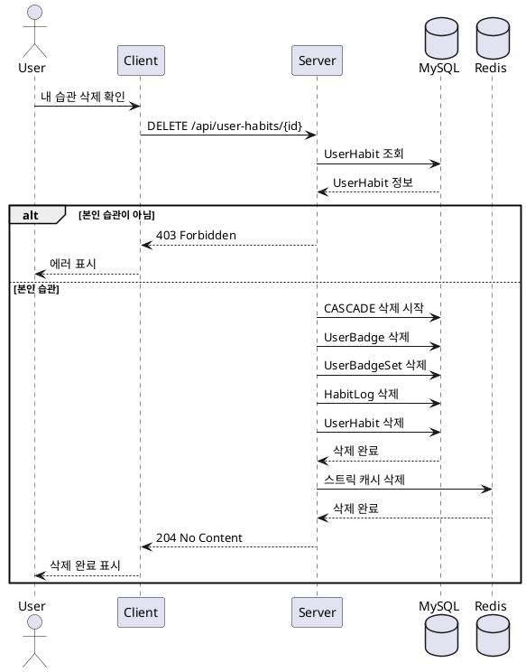

---

## 4. HabitLog

### 4.1 오늘 습관 체크

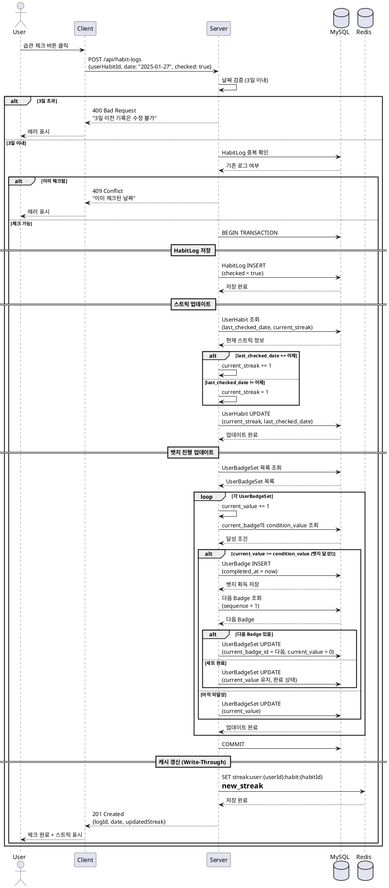

### 4.2 과거 습관 수정 (체크)

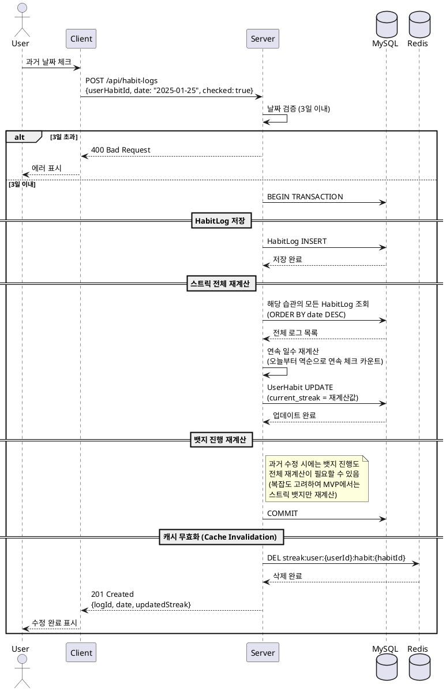

### 4.3 습관 체크 취소

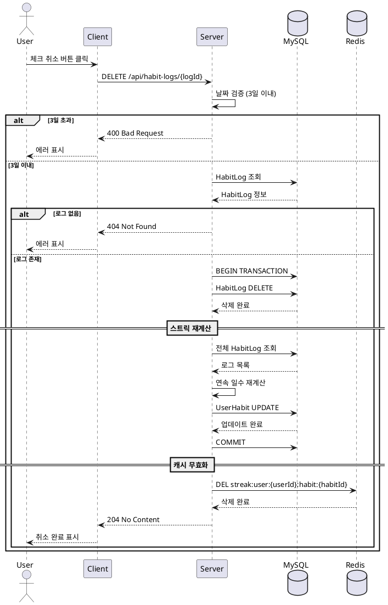

### 4.4 날짜별 전체 습관 현황 조회

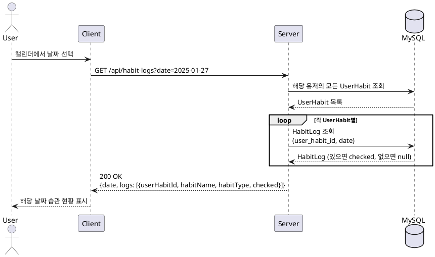

---

## 5. DailyPage

### 5.1 페이지 작성

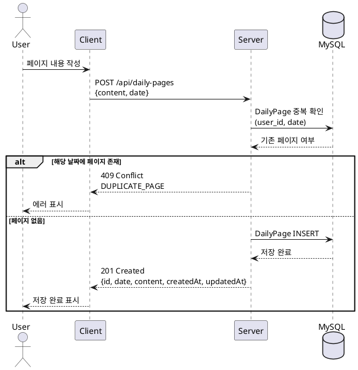

### 5.2 페이지 수정

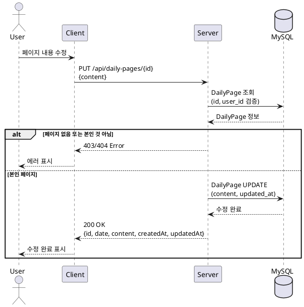

### 5.3 페이지 조회

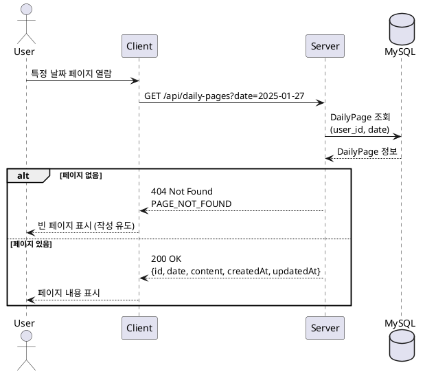

### 5.4 페이지 삭제

```plantuml
@startuml 페이지 삭제
actor User
participant Client
participant Server
database MySQL

User -> Client: 페이지 삭제 확인
Client -> Server: DELETE /api/daily-pages/{id}
Server -> MySQL: DailyPage 조회\n(id, user_id 검증)
MySQL --> Server: DailyPage 정보

alt 페이지 없음 또는 본인 것 아님
    Server --> Client: 403/404 Error
    Client --> User: 에러 표시
else 본인 페이지
    Server -> MySQL: DailyPage DELETE
    MySQL --> Server: 삭제 완료
    Server --> Client: 204 No Content
    Client --> User: 삭제 완료 표시
end

@enduml
```

### 5.5 월별 캘린더 조회

```plantuml
@startuml 월별 캘린더 조회
actor User
participant Client
participant Server
database MySQL

User -> Client: 캘린더 화면 진입\n(2025년 1월)
Client -> Server: GET /api/daily-pages/calendar?year=2025&month=1
Server -> MySQL: 해당 월의 DailyPage 조회\n(user_id, date BETWEEN 1/1 AND 1/31)
MySQL --> Server: DailyPage 목록

Server -> Server: 각 날짜별 hasContent, preview 매핑

Server --> Client: 200 OK\n{year, month, days: [{date, hasContent, preview}]}
Client --> User: 캘린더에 작성 여부 표시\n(● 작성함 / ○ 미작성)

@enduml
```

---

## 6. Badge

### 6.1 전체 뱃지세트 조회

```plantuml
@startuml 전체 뱃지세트 조회
actor User
participant Client
participant Server
database MySQL

User -> Client: 뱃지 목록 화면 진입
Client -> Server: GET /api/badges
Server -> MySQL: 모든 BadgeSet 조회
MySQL --> Server: BadgeSet 목록

loop 각 BadgeSet별
    Server -> MySQL: Badge 목록 조회\n(badge_set_id)
    MySQL --> Server: Badge 목록
end

Server --> Client: 200 OK\n{badgeSets: [{id, name, description, badges: [...]}]}
Client --> User: 전체 뱃지세트 표시

@enduml
```

### 6.2 내 뱃지 현황 조회

```plantuml
@startuml 내 뱃지 현황 조회
actor User
participant Client
participant Server
database MySQL

User -> Client: 내 뱃지 화면 진입
Client -> Server: GET /api/badges/my
Server -> MySQL: UserBadge 목록 조회\n(user_id = 현재유저)
MySQL --> Server: 획득한 뱃지 목록

Server -> MySQL: UserBadgeSet 목록 조회\n(user_id = 현재유저)
MySQL --> Server: 진행 중인 뱃지세트 목록

loop 각 UserBadgeSet별
    Server -> MySQL: BadgeSet, current_badge 정보 조회
    Server -> MySQL: UserHabit → Habit 정보 조회 (habitName)
    MySQL --> Server: 관련 정보
    Server -> Server: progress 계산\n(currentValue / conditionValue * 100)
end

Server --> Client: 200 OK\n{acquired: [...], inProgress: [...]}
Client --> User: 획득 뱃지 + 진행 현황 표시

@enduml
```

### 6.3 최근 획득 뱃지 조회

```plantuml
@startuml 최근 획득 뱃지 조회
actor User
participant Client
participant Server
database MySQL

User -> Client: 최근 뱃지 확인
Client -> Server: GET /api/badges/recent?limit=5
Server -> MySQL: UserBadge 최근 조회\n(user_id, ORDER BY completed_at DESC, LIMIT 5)
MySQL --> Server: UserBadge 목록

loop 각 UserBadge별
    Server -> MySQL: Badge 정보 조회 (name, icon)
    Server -> MySQL: UserBadgeSet → UserHabit → Habit 조회 (habitName)
    MySQL --> Server: 관련 정보
end

Server --> Client: 200 OK\n[{badgeName, badgeIcon, habitName, acquiredAt}]
Client --> User: 최근 획득 뱃지 표시

@enduml
```

---

## 7. AiFeedback

### 7.1 오늘 피드백 조회 (없으면 생성)

```plantuml
@startuml 오늘 피드백 조회
actor User
participant Client
participant Server
database MySQL
participant OpenAI

User -> Client: 앱 실행 (오늘 첫 접속)
Client -> Server: GET /api/ai-feedback/today
Server -> MySQL: 오늘 AiFeedback 조회\n(user_id, date = today)
MySQL --> Server: AiFeedback (있으면)

alt 오늘 피드백 이미 존재
    Server --> Client: 200 OK\n{id, date, message, createdAt}
    Client --> User: 피드백 표시
else 오늘 피드백 없음 (생성 필요)
    == 어제 기록 수집 ==
    Server -> MySQL: 어제 HabitLog 조회\n(date = yesterday)
    MySQL --> Server: 어제 습관 체크 현황
    
    Server -> MySQL: 어제 DailyPage 조회\n(date = yesterday)
    MySQL --> Server: 어제 작성 내용
    
    Server -> MySQL: UserHabit 스트릭 정보 조회
    MySQL --> Server: 스트릭 정보
    
    == AI 피드백 생성 ==
    Server -> Server: 프롬프트 구성\n(습관 현황 + 스트릭 + 페이지 내용)
    Server -> OpenAI: 피드백 생성 요청
    OpenAI --> Server: AI 응답 (message)
    
    == 저장 ==
    Server -> MySQL: AiFeedback INSERT\n(date = today, message)
    MySQL --> Server: 저장 완료
    
    Server --> Client: 200 OK\n{id, date, message, createdAt}
    Client --> User: 피드백 표시\n"어제 운동 7일 연속 성공! 💪"
end

@enduml
```

### 7.2 특정 날짜 피드백 조회

```plantuml
@startuml 특정 날짜 피드백 조회
actor User
participant Client
participant Server
database MySQL

User -> Client: 캘린더에서 과거 날짜 선택
Client -> Server: GET /api/ai-feedback?date=2025-01-25
Server -> MySQL: AiFeedback 조회\n(user_id, date)
MySQL --> Server: AiFeedback 정보

alt 피드백 없음 (그날 접속 안 함)
    Server --> Client: 404 Not Found
    Client --> User: "해당 날짜의 피드백이 없습니다"
else 피드백 있음
    Server --> Client: 200 OK\n{id, date, message, createdAt}
    Client --> User: 과거 피드백 표시
end

@enduml
```

---

## 8. 통합 시나리오

### 8.1 캘린더 날짜 선택 시 통합 조회

```plantuml
@startuml
title Calendar Date Selection
actor User
participant Client
participant Server
database MySQL

User -> Client: Select January 25th from Calendar
== Parallel API Calls ==
par Habit Status
    Client -> Server: GET /api/habit-logs?date=2025-01-25
    Server -> MySQL: Query HabitLog
    MySQL --> Server: Habit Status
    Server --> Client: {logs: [...]}
else Daily Pages
    Client -> Server: GET /api/daily-pages?date=2025-01-25
    Server -> MySQL: Query DailyPage
    MySQL --> Server: Page Content
    Server --> Client: {content: "..."}
else AI Feedback
    Client -> Server: GET /api/ai-feedback?date=2025-01-25
    Server -> MySQL: Query AiFeedback
    MySQL --> Server: Feedback
    Server --> Client: {message: "..."}
end

Client -> Client: Merge 3 Responses
Client --> User: Display Unified Screen

@enduml
```

### 8.2 하루 기록 완료 플로우

```plantuml
@startuml 하루 기록 완료 플로우
actor User
participant Client
participant Server
database MySQL
database Redis

User -> Client: 저녁에 앱 접속

== 습관 체크 ==
loop 각 습관별
    User -> Client: 습관 체크
    Client -> Server: POST /api/habit-logs\n{userHabitId, checked: true}
    Server -> MySQL: HabitLog 저장
    Server -> MySQL: 스트릭 업데이트
    Server -> MySQL: 뱃지 진행 업데이트
    Server -> Redis: 캐시 갱신
    Server --> Client: 체크 완료

    alt 뱃지 달성
        Client --> User: 🎉 뱃지 획득 알림!
    end
end

== 데일리 페이지 작성 ==
User -> Client: 오늘 페이지 작성
Client -> Server: POST /api/daily-pages\n{content}
Server -> MySQL: DailyPage 저장
Server --> Client: 저장 완료
Client --> User: 오늘 기록 완료!

== 다음날 아침 ==
User -> Client: 앱 접속
Client -> Server: GET /api/ai-feedback/today
Server -> MySQL: 어제 기록 기반 피드백 생성
Server --> Client: 피드백
Client --> User: "어제 3개 습관 모두 성공! 대단해요 💪"

@enduml
```

---

## 문서 정보

| 항목 | 내용 |
|------|------|
| 작성일 | 2025년 1월 27일 |
| 최종 수정일 | 2025년 2월 3일 |
| 작성자 | 정우찬 |
| 관련 문서 | ERD 설계문서, API 명세서 v2 |
